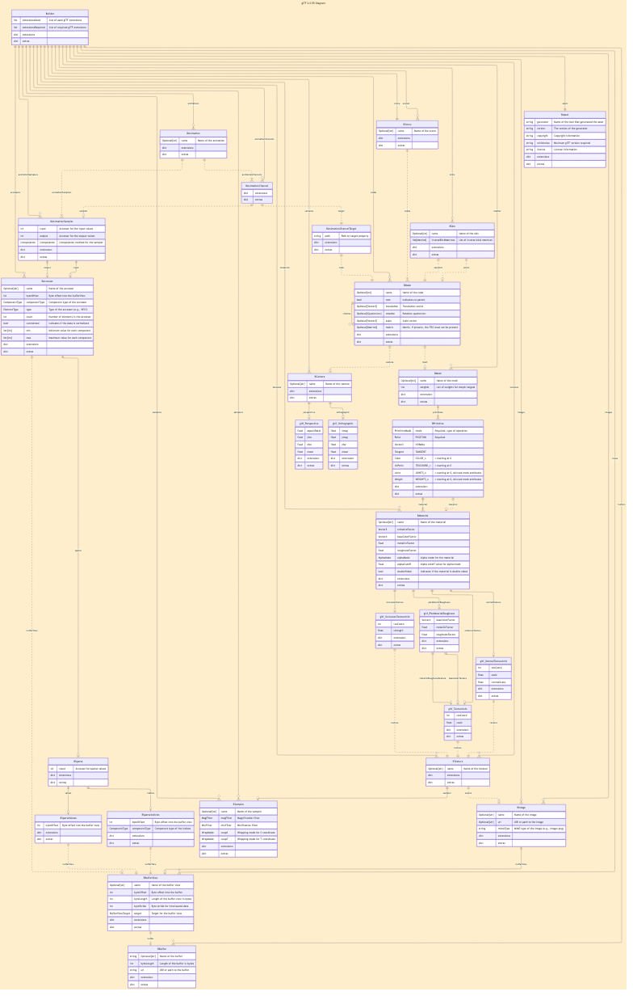
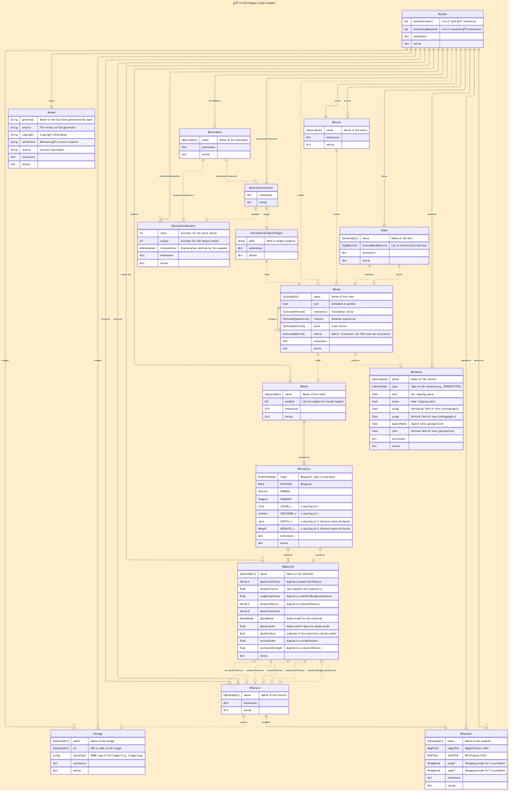

# GTLF Builder

This library wraps the `pygltflib` library to handle the low-level details of managing buffers, buffer views, and accessors.

In this document, we will generalliy refer to  the `pygltflib` library with the `gltf` orefix.

You start by creating a `Builder` instance. There are abstract types corresponding to the major classes from the `pygltflib` library, with names prepended with 'B'. For example, this library supplies a `BNode` class that plays the same role as `gltf.Node`. These classe are compiled to the corresponding `gltf` clases with the `compile()` method, which returns a `pygltflib.GLTF2` instance.

The `BXxxxx` names are abstract; the implementation classes bear names like `_Xxxxx`.

Compilation and collection of the pieces is performed by the `Builder.build()` method.

## Quaternions (Rotations)

Because `pygltflib` uses quaternions of the form (X, Y, Z, W) instead of the form (W, X, Y, Z) used by `scipy`, and to avoid introducing heavyweight and potentially incompatible libraries, we provide (courtesy of ChatGPT to my specifications) an implementation of various quaternion routines relating to rotations.

Basic usage

```python
import gltf_builder.quaternion as Q

# Rotate around Z axis by pi/4
rotation = Q.from_axis_angle((0, 0, 1), math.py / 4)
# Instantiate a geometry, rotated.
root_node.instantiate(cube, rotation=rotation)
```

See [quaternions.md](quaternions.md) or [quaternions.py](src/gltf_builder/quaternions.py) for more information.

## Usage

Install via your usual tool (I recommend `uv` as the modern upgrade from `pip` and others).

```python
from gltf_builder import Builder, PrimitiveMode

CUBE = (
    (0, 0, 0), (0, 0, 1), (0, 1, 1), (0, 1, 0),
    (1, 0, 0), (1, 0, 1), (1, 1, 1), (1, 1, 0),
)
CUBE_FACE1 = (0, 1, 2, 3)
CUBE_FACE2 = (4, 5, 6, 7)
CUBE_FACE3 = (0, 4, 5, 1)
CUBE_FACE4 = (0, 4, 7, 3)
CUBE_FACE5 = (1, 2, 6, 5)
CUBE_FACE6 = (1, 5, 6, 2)

builder = Builder()

mesh = builder.add_mesh('CUBE', detached=True)
mesh.add_primitive(PrimitiveMode.LINE_LOOP, *[CUBE[i] for i in CUBE_FACE1])
mesh.add_primitive(PrimitiveMode.LINE_LOOP, *[CUBE[i] for i in CUBE_FACE2])
mesh.add_primitive(PrimitiveMode.LINE_LOOP, *[CUBE[i] for i in CUBE_FACE3])
mesh.add_primitive(PrimitiveMode.LINE_LOOP, *[CUBE[i] for i in CUBE_FACE4])
mesh.add_primitive(PrimitiveMode.LINE_LOOP, *[CUBE[i] for i in CUBE_FACE5])
mesh.add_primitive(PrimitiveMode.LINE_LOOP, *[CUBE[i] for i in CUBE_FACE6])
top = builder.create_node('TOP')
cube = node('CUBE',
    mesh=mesh,
    translation=(-0.5, -0.5, -0.5),
)
# Instantiate it at the origin
top.instantiate(cube)
# Instantiate it translated, scaled, and rotated.
top.instantiate(cube,
                translation=(2, 0, 0),
                scale=(1, 2, 2),
                rotation=(0.47415988, -0.40342268,  0.73846026,  0.25903472)
            )
gltf = builder.build()
gltf.save_binary('cube.glb')
```

The `builder.build()` method produces a regular `pygltflib.GLTF2` instance.

To create hierarchy, use the `add_node()` method on a parent node.

Note that referencing the same tuple for a point treats it as the same vertex, while a copy will create a separate vertex.

## Instancing

Simple instancing can be done by simply using the same mesh for multiple nodes.

You can also instance a node hierarchy with the `instantiate` method. This takes a node and copies it, optionally supplying a transformation.

The node can be an existing node in the scene, or it cn be created with the `detached=True` option to `add_node()`, which creates the a node that is not added to the scene. You can then use this as the root of an instancable tree, and add child nodes and meshes.

You can access existing nodes by name by the `builder[`_name_`]` syntax. If nodes with the same name appear in different places, you may need to first access a parent that holds only one of the duplicates. Alternatively, you can loop over all nodes like this:

```python
builder = Builder()
# Add a bunch of nodes
...
# Print the names of every node in the tree
for node in builder:
    print(f'node={node.name}')

# Get a list of all nodes named 'Fred'
fred = [n for n in builder if n.name == 'Fred']
```

## Naming

`name_policy` is a configuration option on the `Builder` that determines how names are applied to elements within the GLTF builder. For each naming scope, it can be set to different modes to control the naming behavior:

- `explicit`: Names are only applied to elements that you explicitly name.
- `auto`: Names are automatically generated and applied to all elements.
- `mixed`: A combination of explicit and automatic naming is used.

Adjusting the `name_policy` allows for greater flexibility and control over the naming conventions used in your GLTF files.

## Matrices, Vector types, colors, etc

This includes types and functions for creating vectors, colors, etc. These are useful for providing attribute values, but if you provide the appropriate `tuple` or `np.ndarray` of values, they will be converted with the apporpriate constructor function.

Using the provided functions gives error and range checking, and may inform the library of the intended data type to use, and allows you to use operations like matrix or vector operations.

### Constructor Functions

The main user objects have functions to construct them, rather than using the classes directly.

The functions are declared to return abstract types; the concrete implemention classes are hidden. The public interface is through these abstract types.

| Constructor       | Type                | Description                                     |
|-------------------|---------------------|-------------------------------------------------|
| `point`           | `Point`             ||
| `vector2`         | `Vector2`           ||
| `vector3`         | `Vector3`           ||
| `vector4`         | `Vector4`           ||
| `uv`              | `UvPoint`           | (comes in 8-bit, 16bit, and floating versions)  |
| `tangent`         | `Tangent`           ||
| `scale`           | `Scale`             ||
| `quaternion`      | `Quaternion`        ||
| `matrix2`         | `Matrix2`           ||
| `matrix3`         | `Matrix3`           ||
| `matrix4`         | `Matrix4`           ||
| `color`           | `Color`             | (comes in 8-bit, 16-bit, and floating versions below) |
| `rgb`, `rgba`     | `RGB` and `RGBA`    | Floating point |
| `rgb8`, `rgba8`   | `RGB8` and `RGBA8`  | 8-Bit |
| `rgb16`, `rgba16` | `RGB16`and `RGBA16` | 16 Bit |

These take the expected values, with the following notes:

- All functions, if provided an instance of their constructed type, will return it unchanged.
- `color` takes values betwee 0..1 inlusive. The `size=` keyword argument specifies the data format used, 1, 2, or 4 bytes. 4 bytes uses `np.float32` format.
- `rgb` and `rgba` takes values between 0..1 inclusive, like color, and always uses the `np.float32` format.
- `rgb8`, `rgba8` use integer values between 0..255 inculusive and the 1-byte format.
- `rgb16` and `rgba16` use integer values between 0..65535 inclusive and the 2-byte format.
- `matrix2`, `matric3`, and `matric4` will accept tuples of 4, 9, or 16 values, or tuples of tuples in 2x2, 3x3, or 4x4 form.
- `scale` will accept 3 values, a tuple or `np.ndarray` of 3 values, or a single value to be applied to all three dimensions.
- The `tangent` function constructs `Tangent` values for use as the `TANGENT` vertex attribute. As such, it takes the _X_, _Y_, and _Z_ values like a `Vector3` and a fourth value, either -1 or 1, to indicate its orientation. The `Tangent` value can be treated like a `Vector3`, ie. it supports cross product via the `@` operator.
- `uv` returns texture coordinaes. The `size` argument specifies 1, 2, or 4-byte formats, with the 4-byte format being `np.float32`
- Points (including uv texture coordinates) and vectors are not the same, so have different types:
  - They behave differently under transformation.
  - Vectors add, points do not.
    - But you can subtract points to get a vector.
    - You can add a point and a vector to get a new point.

## Graphic Elements: Nodes, Meshes, Primitives,and more

| Constructor               | Type          | Description           |
|---------------------------|---------------|-----------------------|
| [node](#node)            | `BNode`       | Hierarchical structure |
| [mesh](#mesh)           | `BMesh`       | Holds a list of primitives |
| [primitive](#primitive) | `BPrimitive`  | One drawing operation |
| [camera](#camera)         | `BCamera`     | A camera description  |
|                           | `BPerspectiveCamera`  ||
|                           | `BOrthographicCamera` ||

### glTF model

The full glTF model is here.

Click the image for a full-sized SVG version.
[](https://raw.githubusercontent.com/BobKerns/gltf_builder/refs/heads/main/docs/erDiagram.svg)

Notes:

- Nodes beginning with "B" are part of the Builder model.
- Nodes beginning with "gltf_" are optional internal subfields. These are flattened into their owning objects in the Builder model

### User-level Builder model

As a user building geometry, we don't want to deal with low-level details. The following model elides portions handled automatically:

* Storage layout (Accessors, BufferViews, and Buffers)
* Internal optional subfields are collapsed into their owning objects.

Click the image for a full-sized SVG version.
[](https://raw.githubusercontent.com/BobKerns/gltf_builder/refs/heads/main/docs/erUserSubsetDiagram.svg)

## Node

Nodes represent hierarchical geometry.

## Mesh

...

## Primitive

...

## Camera

...

## Testing

The unit tests and their organization are described in the [Testing README](testing/README.md). Files created by the tests are automatically validated using the official Khronos validator.

## Still Needed

- Animation
- Material support is not yet integrated
- Scoping of indexing and vertex management.
- Lots more documentation and examples.
