# glTF

glTF™ is the WebGL-oriented "WebGL Transfer Format", a format designed consumption by WebGL™. It is standardized by the [The Khronos® 3D Formats Working Group](https://www.khronos.org/gltf/). For technical details, see [the glTF 2.0 standard](https://registry.khronos.org/glTF/specs/2.0/glTF-2.0.html)

The [WebGL 2.0 Specification](https://registry.khronos.org/webgl/specs/latest/2.0/) provides relevant context.

## glTF model

The glTF model, at different levels of abstraction.

- [Geometry model](#geometry-model)
- [User model](#user-model)
- [Full glTF model](#full-gltf-model)

### Geometry model

The geometry model contains sufficient detail to construct a glTF file with wireframe geometry. The primary focus is the node hierarchy, with attached meshes and their primitives.

In addition, it shows where the BCamera instances attach, and how materials attach to primitives, without going into further detail.

Layered on top of the geometry model are materials, skins, morphing, and animation. There is a mechanism for applying extensions to bring additional features.

Click the image for a full-sized SVG version.

### User model

As a user building geometry, we don't want to deal with low-level details. The following model elides portions handled automatically:

- Storage layout (Accessors, BufferViews, and Buffers)
- Internal optional subfields are collapsed into their owning objects.

Click the image for a full-sized SVG version.

### full glTF model

Here is the full glTF model.

Click the image for a full-sized SVG version.

Notes:

- Nodes beginning with "B" are part of the Builder model.
- Nodes beginning with "gltf_" are optional internal subfields. These are flattened into their owning objects in the Builder model
